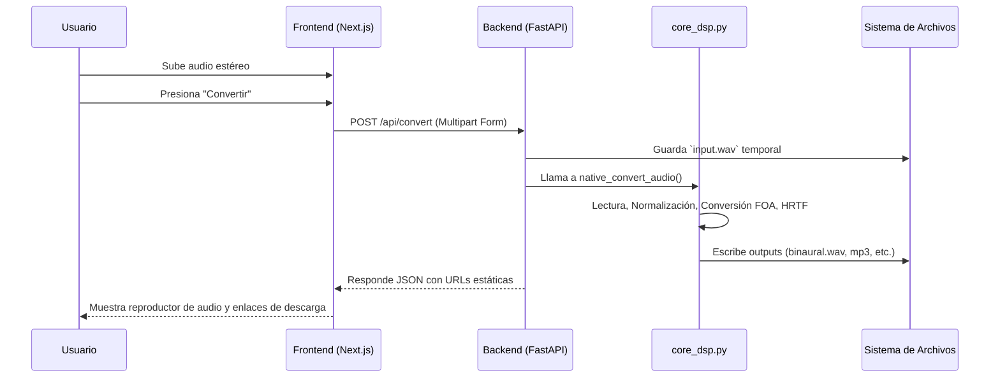

# 00. Introducción

## Objetivo del proyecto
**Ambisonic** es una plataforma web desarrollada con el objetivo de democratizar y simplificar el acceso a la tecnología de audio espacial. El proyecto permite a los usuarios transformar grabaciones convencionales (estéreo) o capturas multicanal (arreglo de 4 micrófonos) en verdaderas experiencias de sonido envolvente de 360 grados, utilizando únicamente algoritmos matemáticos y respuestas de impulso relacionadas con la cabeza (HRTF).

## ¿Qué problema resuelve?
Tradicionalmente, la producción de audio espacial o formato *Ambisonics* requería de software costoso (DAWs), hardware especializado y conocimientos técnicos avanzados de ingeniería de sonido. 
Ambisonic resuelve este problema creando una interfaz sencilla e interactiva donde el usuario, mediante una experiencia web visual, puede procesar y posicionar su sonido en el espacio, obteniendo un archivo `.wav` o `.mp3` binaural listo para ser reproducido en audífonos estándar.

## Tecnologías Utilizadas
La plataforma adopta una arquitectura desacoplada moderna:

### Frontend
- **Framework:** Next.js (versión 16.2.6 con App Router)
- **UI Library:** React 19, Tailwind CSS (postcss, tw-animate-css)
- **Componentes:** shadcn/ui, lucide-react, framer-motion
- **Gráficos 3D:** Three.js (0.185), @react-three/fiber, @react-three/drei
- **Lenguaje:** TypeScript

### Backend y DSP
- **Servidor API:** FastAPI (0.139.0) con Uvicorn
- **Lenguaje:** Python 3
- **Audio Processing:** scipy, numpy, soundfile, pysofaconventions
- **Base de Datos:** El proyecto **NO** utiliza una base de datos convencional (SQL/NoSQL). El feedback de usuarios se almacena en un archivo estático JSON (`backend/feedback.json`).

## Arquitectura General
El proyecto sigue el modelo Cliente-Servidor (Frontend desacoplado del Backend API).

1. **Cliente Web (Frontend):** Se encarga de la interfaz, recolección de los audios, los parámetros de posición espacial a través de controles deslizantes, visualización del entorno 3D y despliegue del resultado final.
2. **API REST (Backend):** Recibe el audio, orquesta el flujo de trabajo hacia los módulos de procesamiento DSP y retorna las URLs estáticas donde se encuentran los audios resultantes.
3. **Módulo DSP:** Escrito en Python nativo (`processor.py` y `core_dsp.py`), lee los audios usando `soundfile`, aplica transformaciones matriciales y de convolución utilizando HRTFs y exporta archivos finales WAV/MP3.

### Flujo Completo del Sistema

