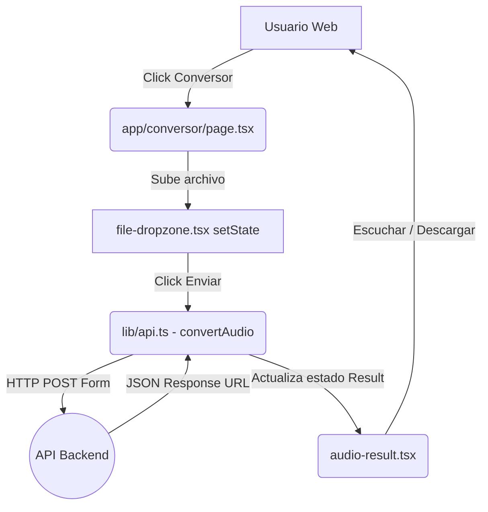

# 02. Frontend

El Frontend de **Ambisonic** está construido con el framework **Next.js 16.2.6** y **React 19**, utilizando el paradigma del **App Router**. Se caracteriza por ser fuertemente tipado (TypeScript) y diseñado usando **Tailwind CSS**.

## ¿Cómo funciona Next.js en este proyecto?

El App Router de Next.js utiliza un sistema de rutas basado en carpetas (File-system based routing). Cualquier carpeta dentro de `app/` que contenga un archivo `page.tsx` se convierte automáticamente en una ruta de la aplicación web.
El código se ejecuta por defecto como *Server Components* (para mejor SEO y menor peso de JS), a menos que el archivo empiece explícitamente con la directiva `'use client'`, en cuyo caso se renderiza y maneja estados en el navegador.

## Rutas y Páginas (`app/`)

- `app/layout.tsx`: Es el Root Layout. Define el esqueleto maestro (etiquetas `<html>`, `<body>`), inyecta los estilos globales (`globals.css`), renderiza el Navbar universal (para que no cambie entre pantallas) y maneja los metadatos globales.
- `app/page.tsx`: Es el **Inicio** (Landing page). Renderiza los componentes `Hero`, el video introductorio y `OptionsSection` para explicar qué es el proyecto de forma amigable.
- `app/conversor/page.tsx`: Página del **Conversor**. Renderiza el cliente (Formulario) para adjuntar archivos y ver el reproductor de resultados (`AudioResult`).
- `app/demo/page.tsx`: Página de la **Demo Interactiva**. Contiene controles deslizantes espaciales y el Canvas 3D de previsualización de audio.
- `app/guia/page.tsx`: Página de la **Guía**. Documentación conceptual no técnica sobre audio espacial, FOA y binaural (usa iconos y tarjetas informativas).
- `app/acerca-de/page.tsx`: Página **Acerca de**. Muestra la historia del proyecto (timeline), los desarrolladores y la institución (UIS).
- `app/sugerencias/page.tsx`: Página de **Sugerencias**. Formulario de contacto y reporte de feedback que envía datos por POST a la API.

## Estilos y Diseño
Todo el diseño se maneja a través de utilidades de **Tailwind CSS**. La configuración reside en `postcss.config.mjs` y dependencias de tailwind. Los estilos globales base están en `app/globals.css`. Se hace amplio uso del concepto *glassmorphism* mediante clases que aplican fondos semitransparentes (ej. `bg-secondary/50`) junto con desenfoques (blur), lo que otorga una estética oscura tipo Aurora ("bg-aurora").

## Componentes Reutilizables (`components/`)
La lógica visual se atomizó para no saturar las rutas.

- **UI Básica (`components/ui/`):** Utilidades genéricas tomadas de `shadcn/ui` como botones (`button.tsx`), sliders (`slider.tsx`), campos de texto (`input.tsx`) formadas con `class-variance-authority`.
- **Navegación:** `navbar.tsx` renderiza los links superiores del menú y el logo del proyecto. `footer.tsx` maneja el pie de página.
- **Formularios e Inputs:** `file-dropzone.tsx` permite al usuario subir archivos mediante drag-and-drop o selector tradicional, actualizando el estado de un File.
- **Gráficos y Visualización:** 
    - `demo/visualizer-3d.tsx`: El lienzo 3D que grafica la fuente sonora (esfera) y el oyente en tiempo real. 
    - `audio-result.tsx`: Componente que parsea y muestra reproductores `<audio>` nativos HTML5 para escuchar o descargar los audios devueltos por el servidor.
- **Transiciones:** `reveal.tsx` usa `framer-motion` para animar los componentes al aparecer en el viewport.

## Flujo de Datos (Data Flow) y Estados

La mayoría del manejo de estado (inputs de usuario) ocurre en Client Components (ej. `conversor-client.tsx` o `demo-client.tsx`).

1. Se utiliza el hook `useState` de React para almacenar el estado del archivo cargado (`File | null`), la carga (`isLoading`), y las respuestas de éxito/error.
2. Al disparar el evento de enviar formulario, la interfaz desactiva botones, muestra indicadores de carga y llama a funciones importadas desde `lib/api.ts`.
3. `api.ts` utiliza `FormData` de JavaScript para empaquetar el archivo `audio` y los datos del formulario (ej. modo, dirección), y dispara peticiones asíncronas (`fetch`) al backend.
4. El Frontend **no procesa** el audio; confía en la respuesta JSON del servidor, la cual contiene URLs de los archivos para actualizar el estado del UI (`setResult()`).

